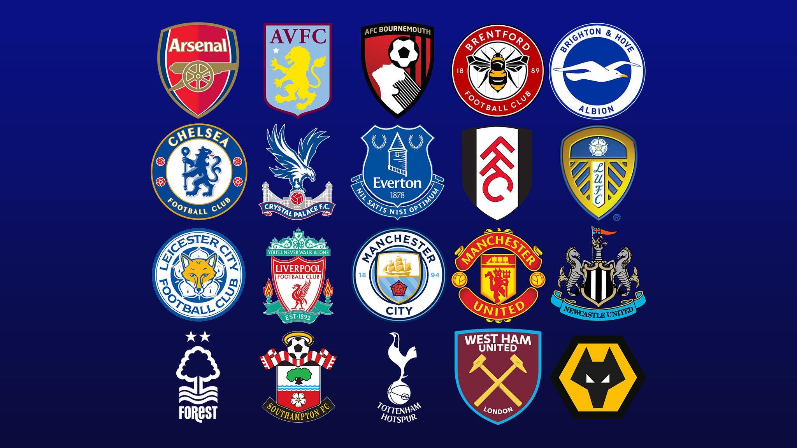

# Project Proposal: Premier League Statsbomb
## Project Description
For my project I would like to create a Premier League CRUD app for the 22/23 season. It aims to 
provide comprehensive football data, including player details, team information and match statistics. I will be using API-Football as my third-party API which will help fetch data to seed our database and potentially retrieve real-time data for certain features.

## Routes
'/api/players'
CRUD Operations:
-  Create: POST /api/players - Create a new player
-  Read: GET /api/players - Retrieve all players
-  Read: GET /api/players/:id - Retrieve a specific player
-  Update: PUT /api/players/:id - Update player information
-  Delete: DELETE /api/players/:id - Delete a player

'/api/teams'
CRUD Operations:
-  Create: POST /api/teams - Create a new team
-  Read: GET /api/teams - Retrieve all teams
-  Read: GET /api/teams/:id - Retrieve a specific team
-  Update: PUT /api/teams/:id - Update team information
-  Delete: DELETE /api/teams/:id - Delete a team

'/api/matches'
CRUD Operations:
-  Create: POST /api/matches - Create a new match
-  Read: GET /api/matches - Retrieve all matches
-  Read: GET /api/matches/:id - Retrieve a specific match
-  Update: PUT /api/matches/:id - Update match information
-  Delete: DELETE /api/matches/:id - Delete a match

## Models
Player:
- name (String)
- position (String)
- team (Reference to Team model)
- nationality (String)

Team:
- name (String)
- coach (String)
- stadium (String)
- city (String)

Match:
- teams (Array of references to Team model)
- date (Date)
- location (String)

## MVP Goals
As an MVP (Most Viable Project), the Premier League Statsbomb app will aim to accomplish the following user stories:

1. As a user, I want to be able to view a list of players, teams, and matches.
2. As a user, I want to be able to create new players, teams, and matches.
3. As a user, I want to be able to update player, team, and match information.
4. As a user, I want to be able to delete players, teams, and matches.

## Stretch Goals
The following user stories can be considered as stretch goals to enhance the premier league statsbomb app

1. As a user, I want to be able to filter players, teams, or matches based on attributes like position, nationality, or date.
2. As a user, I want to see real-time match updates and statistics from API-Football.
3. As a user, I want to be able to authenticate and have personalized access to specific features.